

# PWM Basic Configuration Example using the PIC18F47Q10 Microcontroller with MCC Melody

This repository contains an example of MCC® Melody generated code for Pulse Width Modulation (PWM) signals using Capture/Compare/PWM (CCP) module as described in [*TB3270 - Getting Started with PWM Using CCP on PIC18*](http://ww1.microchip.com/downloads/en/Appnotes/Getting-Started-with-PWM-Using-CCP-on-PIC18-DS90003270A.pdf) document from Microchip.
 The PIC18F47Q10 features four 10-bit PWM generators. This example describes how to configure the CCP1 peripheral in conjunction with TMR2 to produce a low speed PWM signal.
 Two GPIO pins are used. RE2 as an input to read the on-board button for controlling the demo and RB4 as a PWM output.

## Related Documentation

- [Getting Started with PWM Using CCP on PIC18](http://ww1.microchip.com/downloads/en/Appnotes/Getting-Started-with-PWM-Using-CCP-on-PIC18-DS90003270A.pdf)
- [PIC18-Q10 Product Family Page](https://www.microchip.com/design-centers/8-bit/pic-mcus/device-selection/pic18f-q10-product-family)
- [PIC18F47Q10 Data Sheet](http://ww1.microchip.com/downloads/en/DeviceDoc/40002043D.pdf)
- [PIC18F47Q10 Code Examples on GitHub](https://github.com/microchip-pic-avr-examples?q=pic18f47q10)

## Software Used

- [MPLAB® X IDE v6.05 or newer](http://www.microchip.com/mplab/mplab-x-ide)
- [MPLAB® XC8 2.40 or newer](http://www.microchip.com/mplab/compilers)
- [MPLAB® Code Configurator Melody](https://www.microchip.com/en-us/tools-resources/configure/mplab-code-configurator/melody)
- [MPLAB® Data Visualizer](https://www.microchip.com/en-us/tools-resources/debug/mplab-data-visualizer)
- [PIC18F-Q_DFP Device Family Pack v1.15.360 or newer](https://packs.download.microchip.com/)

## Hardware Used

- PIC18F47Q10 Curiosity Nano Development Board is used as a test platform. [(DM182029)](https://www.microchip.com/Developmenttools/ProductDetails/DM182029)
   
- Oscilloscope or logic analyzer for visualization

## Operation

To program the Curiosity Nano board with this MPLAB® X project, follow the steps provided in the [How to Program the Curiosity Nano Board](#how-to-program-the-curiosity-nano-board) chapter.  

## 1. Setup

The following peripheral and clock configurations are set up using MCC Melody for the PIC18F47Q10: 

 - Clock Control:
    - Clock Source: LFINTOSC
    - Clock Divider: 1
  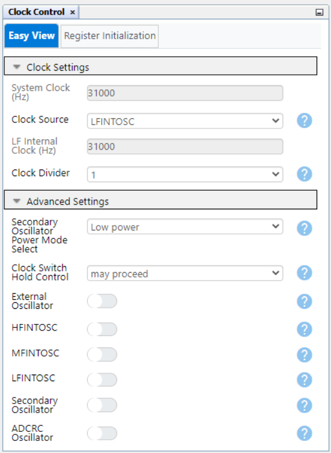

 - Configuration Bits:
    - CONFIG3L
        - WDT Operating Mode: WDT Disabled
    - 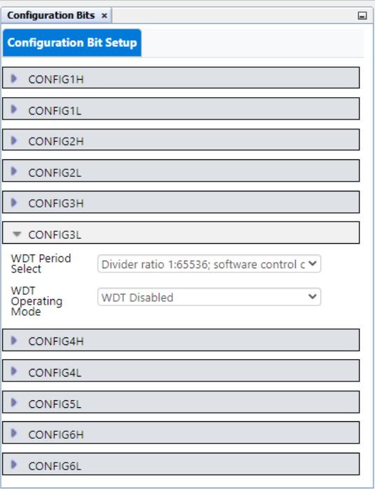 

 - CCP1:
    - CCP Mode: PWM
    - Select Timer: Timer2
    - TMR Dependency Selector: Timer2
    - CCPR Alignment: Right Aligned
    - Enable CCP: Enabled
  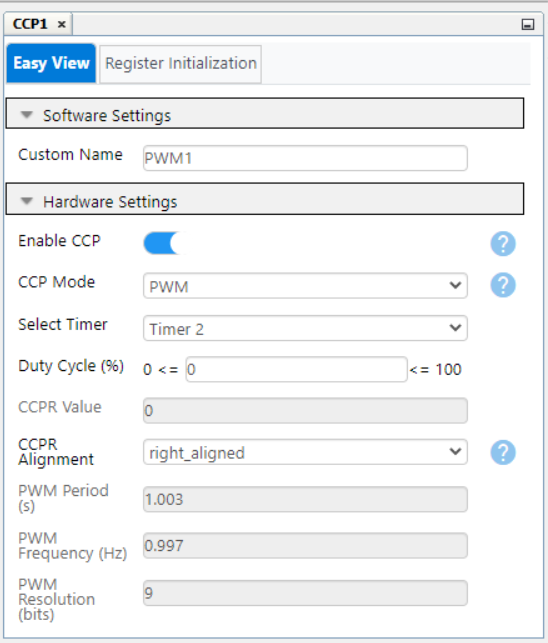

 - TMR2:
    - TMR Dependency Selector: Timer2
    - Enable Timer: Enabled
    - Clock Source: FOSC/4
    - Prescaler: 1/32
    - Time Period (s): 1
  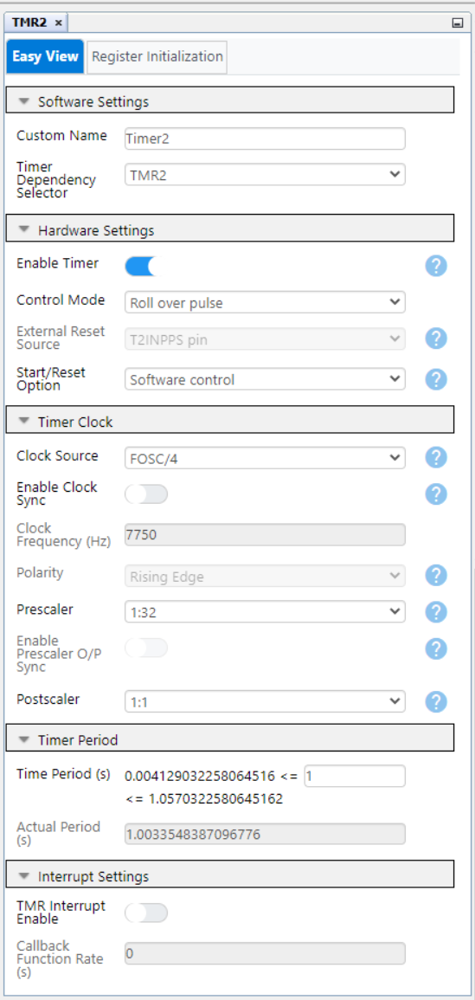

 - Pin Grid View:
    - CCP1 (in/out): RB4
    - GPIO input: RE2
  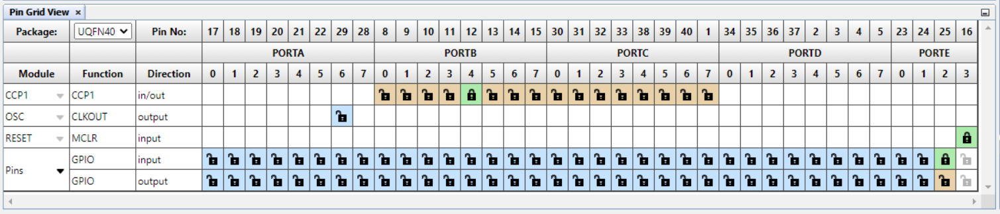

 - Pins:
    - RB4: 
        - Function: CCP1
        - Direction: in/out
    - RE2: 
        - Function: GPIO
        - Direction: input
        - Custom Name: Button
        - Weak Pullup: Enabled

 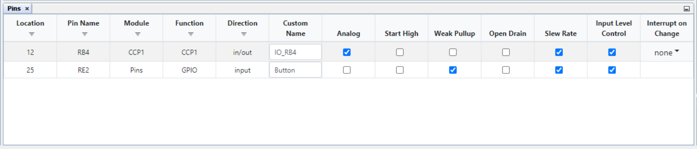

The following pin configuration must be made for this project:

|  Pin  |    Configuration    |      Function       |
| :---: | :-----------------: | :-----------------: |
|  RB4  | Digital Output      | PWM CCP1            |
|  RE2  | Digital Input       | GPIO - Button       |

**Note:** - RE0 (LED0) pin kept as input - Optionally used for LED visualization

## 2. Demo

To run this example, there are two options, choose one of the following:
 - hook the oscilloscope / logic analyzer probe on RB4 pin
 - run a wire between RB4 and RE0

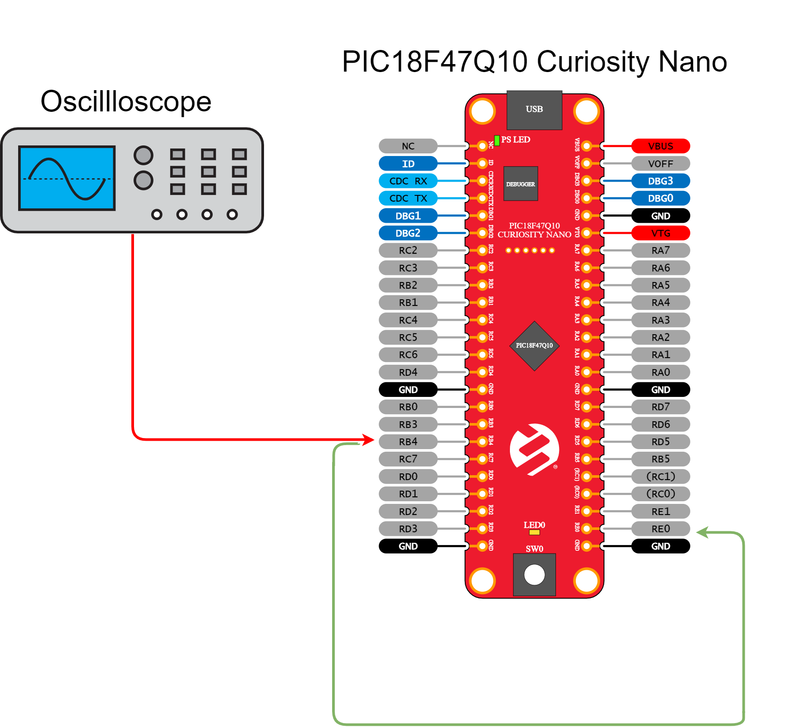

Then run the code generated by MCC, RB4 will generate a PWM signal with a frequency of 1Hz. To demonstrate the run-time update of the PWM parameters, SW0 (RE2) push-button is used.
 - A short button press (less than 1.5 seconds) results in a change of duty-cycle in steps of 25% (from 25% up to 75%)
 - A long button press (1.5 to 2.0 seconds) results in a change of frequency from 1Hz to 4Hz in steps of 1Hz

**Snapshots of different cofigurations:**
    
- Frequency: 1Hz, Duty-Cycle: 25%
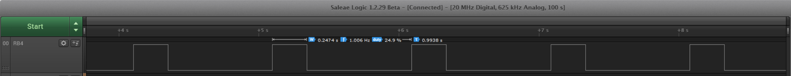

- Frequency: 1Hz, Duty-Cycle: 505%
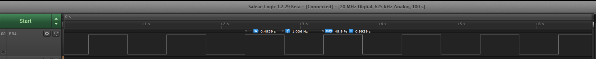

- Frequency: 1Hz, Duty-Cycle: 75%
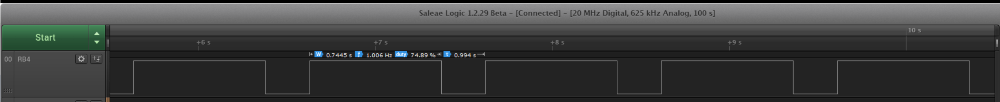

- Frequency: 2Hz, Duty-Cycle: 25%
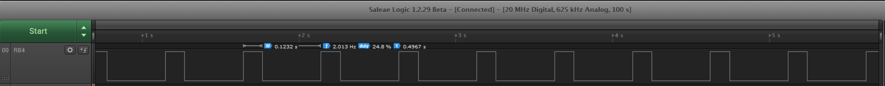

- Frequency: 3Hz, Duty-Cycle: 25%
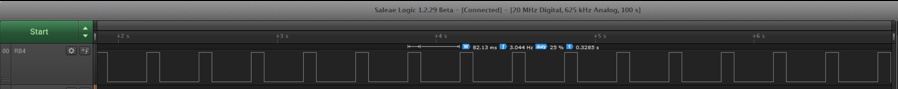

- Frequency: 4Hz, Duty-Cycle: 25%
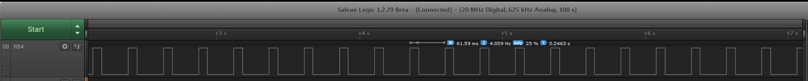

## 3. Summary
This project showcases how to configure basic PWM functionalities, such like duty cycle and frequency on the PIC18F47Q10 microcontroller. The example shows both MCC initialization of the CCP1 and TMR2 for PWM and update of parameters at run-time.

##  How to Program the Curiosity Nano board

This chapter shows how to use the MPLAB® X IDE to program an PIC® device with an Example_Project.X. This can be applied for any other projects. 

- Connect the board to the PC.

- Open the Example_Project.X project in MPLAB X IDE.

- Set the Example_Project.X project as main project.

  - Right click on the project in the **Projects** tab and click **Set as Main Project**.
     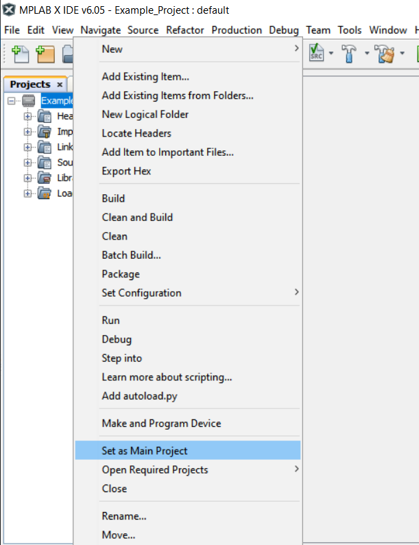

- Clean and build the Example_Project.X project.

  - Right click on the **Example_Project.X** project and select **Clean and Build**.
     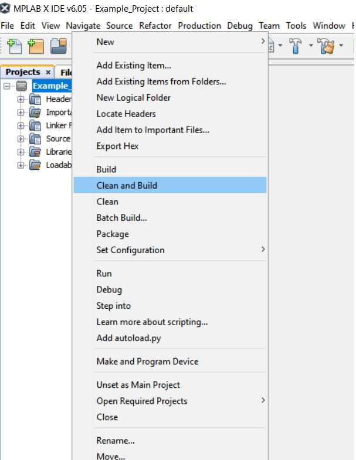

- Select the **PICxxxxx Curiosity Nano** in the Connected Hardware Tool section of the project settings:

  - Right click on the project and click **Properties**
  - Click on the arrow under the Connected Hardware Tool
  - Select the **PICxxxxx Curiosity Nano** (click on the **SN**), click **Apply** and then click **OK**:
     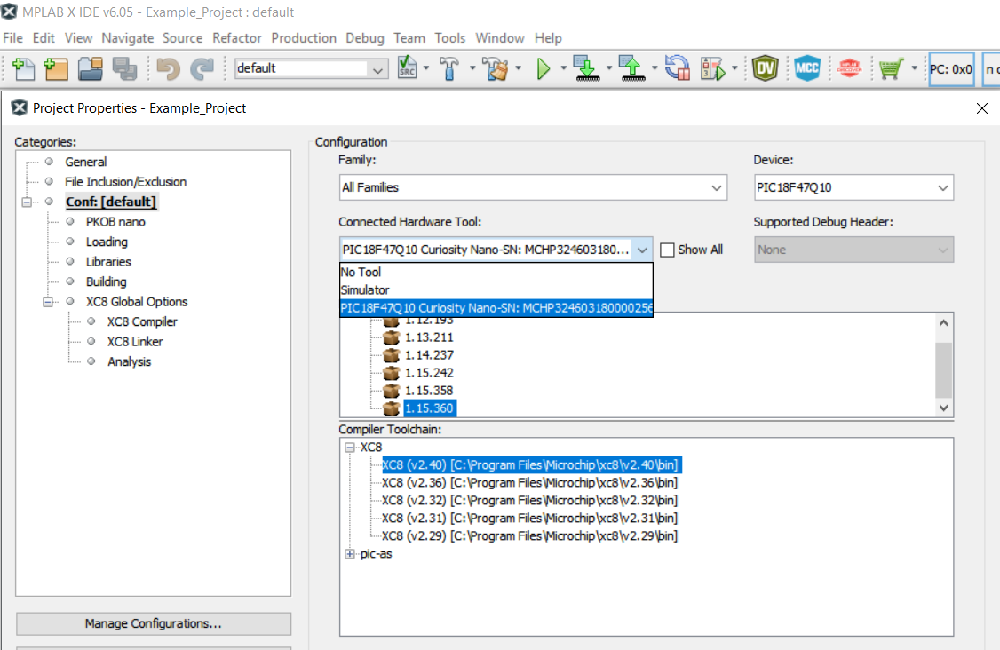

- Program the project to the board.
  - Right click on the project and click **Make and Program Device**.
     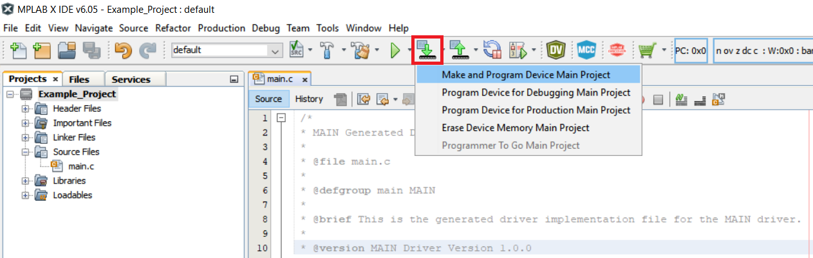

 

- [Back to Setup](#1-setup)
- [Back to Demo](#2-demo)
- [Back to Summary](#3-summary) 
- [Back to Top](#pwm-basic-configuration-example-using-the-pic18f47q10-microcontroller-with-mcc-melody)
