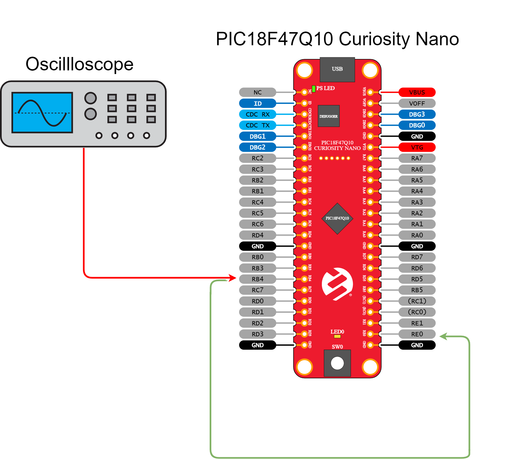

 <article class="markdown-body entry-content p-3 p-md-6" itemprop="This needs to locked down and 'never' changed">

# PIC18F47Q10 PWM Basic Configuration

## Objective:
This repository contains an example of MCC generated code for PWM as described in [*TB3270 - Getting Started with PWM Using CCP on PIC18*](http://ww1.microchip.com/downloads/en/Appnotes/Getting-Started-with-PWM-Using-CCP-on-PIC18-DS90003270A.pdf) document from Microchip.
 The PIC18F47Q10 features four 10-bit PWM generators. This example describes how to configure the CCP1 peripheral in conjunction with TMR2 to produce a low speed PWM signal.
 Two GPIO pins are used. RE2 as an input to read the on-board button for controlling the demo and RB4 as a PWM output.

## Related Documentation
- [TB3270 - Getting Started with PWM Using CCP on PIC18](http://ww1.microchip.com/downloads/en/Appnotes/Getting-Started-with-PWM-Using-CCP-on-PIC18-DS90003270A.pdf)
- [PIC18-Q10 Product Family Page](https://www.microchip.com/design-centers/8-bit/pic-mcus/device-selection/pic18f-q10-product-family)
- [PIC18F47Q10 Data Sheet](http://ww1.microchip.com/downloads/en/DeviceDoc/40002043D.pdf)
- [PIC18F47Q10 Code Examples on GitHub](https://github.com/microchip-pic-avr-examples?q=pic18f47q10-cnano)

## Software Used
- MPLAB® X IDE 5.30 or newer [(microchip.com/mplab/mplab-x-ide)](http://www.microchip.com/mplab/mplab-x-ide)
- MPLAB® XC8 2.10 or newer [(microchip.com/mplab/compilers)](http://www.microchip.com/mplab/compilers)
- MPLAB® Code Configurator (MCC) 3.95.0 or newer [(microchip.com/mplab/mplab-code-configurator)](https://www.microchip.com/mplab/mplab-code-configurator)
- MPLAB® Code Configurator (MCC) Device Libraries PIC10 / PIC12 / PIC16 / PIC18 MCUs 1.79.0 or newer [(microchip.com/mplab/mplab-code-configurator)](https://www.microchip.com/mplab/mplab-code-configurator)
- Microchip PIC18F-Q Series Device Support 1.3.89 or newer [(packs.download.microchip.com/)](https://packs.download.microchip.com/)

## Hardware Used
- PIC18F47Q10 Curiosity Nano [(DM182029)](https://www.microchip.com/Developmenttools/ProductDetails/DM182029)
- Oscilloscope or logic analyzer for visualization - optional

## Setup
The PIC18F47Q10 Curiosity Nano Development Board is used as the test platform.

 

The following configuration is done for this example:
- RB4 pin - Configured as digital PWM output (CCP1)
- RE2 pin - Configured as digital input with pull-up for button SW0
- RE0 (LED0) pin kept as input - Optionally used for LED visualization

## Operation

To run this example, there are two options, choose one of the following:
 - hook the oscilloscope probe on RB4
 - run a wire between RB4 and RE0

Then run the code generated by MCC, RB4 will generate a PWM signal with a frequency of 1Hz. To demonstrate the run-time update of the PWM parameters, SW0 push-button is used.
 - A short press produces a change of duty-cycle in steps of 25%
 - A long press produces a change of frequency from 1Hz to 4Hz in steps of 1Hz

## Summary
This project showcases how to configure basic PWM functionalities, such like duty cycle and frequency on the PIC18F47Q10 microcontroller. The example shows both MCC initialization of the CCP1 and TMR2 for PWM and update of parameters at run-time.

